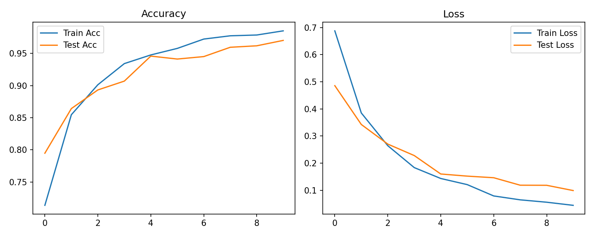

**🧠 Brain Tumor Classification using CNN**

This project implements a Convolutional Neural Network (CNN) to classify brain MRI images into tumor and non-tumor categories. It is designed as a practical deep learning project for healthcare applications, demonstrating skills in image preprocessing, CNN architecture design, model training, and evaluation.

**🚀 Project Overview**

Built a CNN model from scratch using Tensorflow.

Trained on publicly available Brain MRI dataset.

Implemented image preprocessing (resizing, normalization, augmentation).

Evaluated performance using training and testing accuracy.

**⚙️ Tech Stack**

Language: Python 🐍

Libraries: Tensorflow, NumPy, Pandas, Matplotlib, scikit-learn

Tools: Git, VS Code

**📊 Results**

Achieved ~95% accuracy on test set.

CNN successfully differentiates between all the classes mentioned.

Visualization of training vs validation accuracy:

**▶️ How to Run**

Clone the repository:

https://github.com/Faisal-58/Brain-tumor-classification-CNN-.git

Install dependencies:

pip install -r requirements.txt

Run training:

python main.py

**🔮 Future Work**

Deploy as a web app using Streamlit.

Experiment with transfer learning (ResNet, EfficientNet) for higher accuracy.

**✨ Author**

👤 Faisal Ijaz

💻 [GitHub](https://github.com/Faisal-58)  
🔗 [LinkedIn](https://www.linkedin.com/in/faisal-ijaz-44524179/)  

